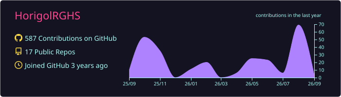
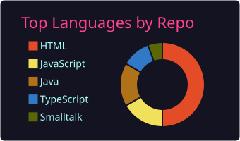
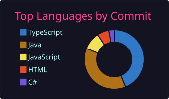

<!-- Header Banner -->

  

  

 

<!-- Tech Stack -->
<h2 align="center">🛠️ My Tech Stack</h2>
 

  <h4>Languages</h4>
  
    
  
  <h4>Frontend</h4>
  
    
  
  <h4>Backend & Frameworks</h4>
  
    
  
  <h4>Database & Cloud</h4>
  
    
  
  
  
    
  
  <h4>Mobile & Game</h4>
  
    
  
  <h4>Tools & DevOps</h4>
  
    
  
  <h4>IDEs & Editors</h4>
  

 

<!-- GitHub Stats -->
<h2 align="center">📊 GitHub Stats & Streak</h2>

  
  

  
  

 

<!-- Contribution Art -->
<h2 align="center">🎨 Contribution Art</h2>

<h3 align="center">The Contribution Snake</h3>

  <picture>
    <source media="(prefers-color-scheme: dark)" srcset="https://raw.githubusercontent.com/HorigolRGHS/HorigolRGHS/output/github-contribution-grid-snake-dark.svg">
    <source media="(prefers-color-scheme: light)" srcset="https://raw.githubusercontent.com/HorigolRGHS/HorigolRGHS/output/github-contribution-grid-snake.svg">
    
  </picture>

<h3 align="center">3D Contribution Profile</h3>

  

 

<!-- GIF -->

  

